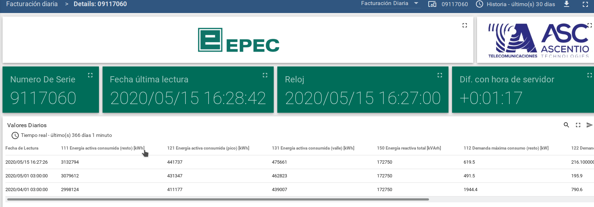

- Estado: Revisado por el equipo
- participantes: mcabral, marrieta, mpanell, ccorrea, ggiuliodori

- Fecha: 28/04/20 (fecha aproximada)

## [Hexing] Pruebas de billing diario en producción

Se desea hacer una lectura del billing diario y en el banco de pruebas no tenemos funcionando el medidor hexing.

## Opciones

- Ir a las oficinas de ascentio en cordoba y buscar el medior para revisar el problema que tiene y habilitarlo.
- hacer la prueba en producción con un medidor especifico que nos habilite EPEC.
  - hay que notar que la prueba en producción genera telemetría basura y esta luego no la podemos borrar.

## opción seleccionada

Debido a que habilitar el medidor existente implica circular por cordoba y ademas del medidor se requiere:
- el chupete para poder conectarse
- la notebook con el programa de lectura
y esos elementos están en diferentes lugares, se opta por hacer la prueba en producción

## Prueba en producción

Para la prueba se utiliza el medidor con Id: 09117060

## Resultado de la prueba

Se realizaron varias pruebas y como resultados tenemos varias lecturas incorrectas (ver en la imagen)

Hay que tener en cuenta que los valores de la imagen, son de pruebas y deben ser ignorados

::: warning

En este caso, para el medidor **09117060** los valores mostrados en la tabla: el segundo y tercero, no se dan garantias que los valores mostrados sean los que corresponden a los tiempos mostrados en la columna "Fecha de lectura"
Estos errores de lectura generaron los siguientes bugs:
- [https://jira.ascentio.com.ar/browse/EPEC-668](https://jira.ascentio.com.ar/browse/EPEC-668)
- [https://jira.ascentio.com.ar/browse/EPEC-694](https://jira.ascentio.com.ar/browse/EPEC-694)
- [https://jira.ascentio.com.ar/browse/EPEC-699](https://jira.ascentio.com.ar/browse/EPEC-699)

:::
