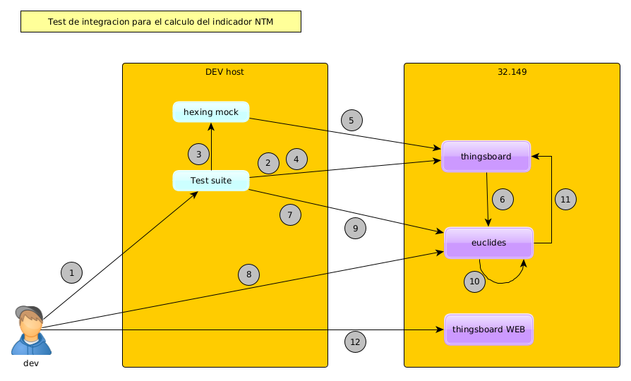

## Flujo de test de integración

Diagrama de flujo

Pasos:

- 1: se ejecuta la suite de test
- 2: se conecta con thingsboard
- 3: se inicia el hexing-mock
- 4: se envía el curl para habilitar la lectura de profiles
- 5: se publican los valores de profiles en thingsboard
- 6: se publican los valores de profiles en mongo en el motor de cálculos
- 7: se envía el comando para calcular el indicador nti (necesario para calcular el ntm)
- 8: validamos que el valor nti es el correcto
- 9: se envía el comando para realizar el cálculo del indicador ntm
- 10: se reliza el cálculo del indicador ntm y se publica en base de datos mongo (euclides)
- 11: se publica el valor del cálculo en thingsboard 
- 12: se valida que el valor mostrado en la web de thingsboard es el correspondiente 